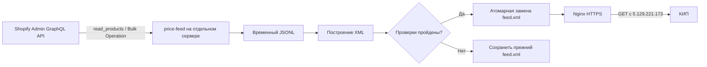

# Архитектура и жизненный цикл

## Схема

Генератор может работать на отдельном сервере и не обязан находиться на сервере сайта. Ему нужны исходящий HTTPS-доступ к Shopify, Python, планировщик и каталог, доступный локальному Nginx. Сайт Shopify продолжает работать независимо.

## Один запуск

1. Процесс получает краткоживущий Admin API token по client credentials либо использует заданный offline token.
2. Проверяет базовую валюту магазина, если выбран режим `base`.
3. Запускает `bulkOperationRunQuery` для активных вариантов.
4. Опрос ведётся по ID именно этой операции; при таймауте ID сохраняется для следующего запуска.
5. Подписанный JSONL скачивается без Admin-токена в заголовках.
6. Каждая строка JSONL преобразуется в отдельный `offer`.
7. Вариант с отсутствующими обязательными данными пропускается и записывается в статистику. Остальной фид продолжает формироваться.
8. XML сначала записывается во временный файл рядом с целевым.
9. Проверяются структура, обязательные поля, цены, валюта, категории, HTTPS-ссылки и уникальность ID.
10. После успешной проверки `os.replace` атомарно заменяет опубликованный файл.

## Защита от сбоев

- Сбой API, неполный Bulk-файл, дубликат ID, невалидный XML или ошибка записи не заменяют последний корректный фид.
- `flock` блокирует одновременные ручные запуски.
- systemd не запускает второй экземпляр уже работающего oneshot-сервиса.
- Временные сетевые ошибки и throttling повторяются в пределах настроенного бюджета.
- Redirect при запросах API и скачивании отклоняется.
